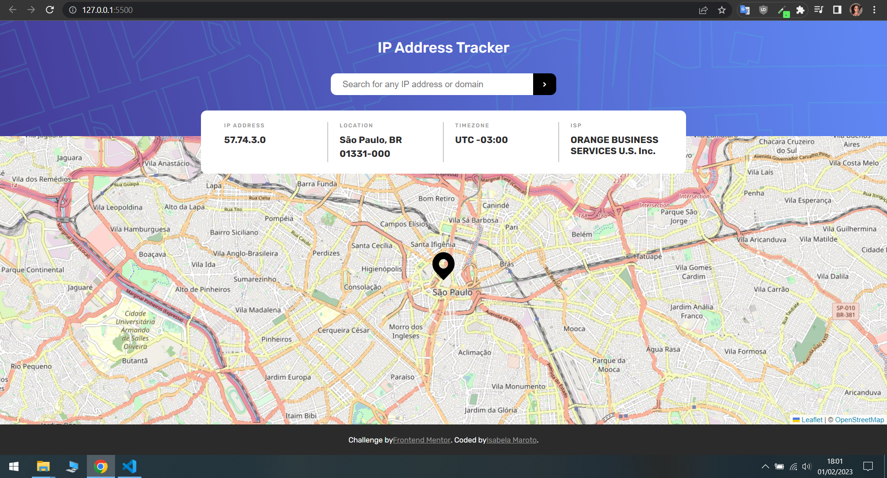

# Frontend Mentor - IP Adress Tracker app solution

This is a solution to the [IP Adress Tracker app challenge on Frontend Mentor](https://www.frontendmentor.io/challenges/ip-address-tracker-I8-0yYAH0). Frontend Mentor challenges help you improve your coding skills by building realistic projects.

## Table of contents

- [Overview](#overview)
  - [The challenge](#the-challenge)
  - [Screenshot](#screenshot)
  - [Links](#links)
  - [Built with](#built-with)
- [Author](#author)

## Overview

### The challenge

Users should be able to:

- View the optimal layout for the app depending on their device's screen size
- See hover states for all interactive elements on the page
- Generate a new piece of advice by clicking the dice icon

### Screenshot

### Links

- Solution URL: [https://www.frontendmentor.io/solutions/ip-address-with-js-vanilla-and-flexbox-nnmuebW7j9]
- Live Site URL: [https://ip-adress-project-isabelamaroto.vercel.app/]

### Built with

- Semantic HTML5 markup
- SCSS
- Flexbox
- Vanilla JavaScript

## Author

- Frontend Mentor - [@IsabelaMaroto](https://www.frontendmentor.io/profile/IsabelaMaroto)